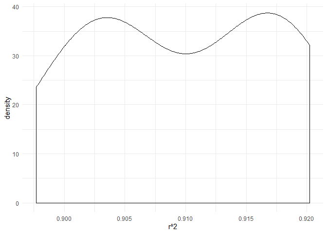

p8105\_hw6\_mss2284
================
Maya Spaur
11/16/2019

``` r
library(tidyverse)
```

    ## -- Attaching packages --------------- tidyverse 1.2.1 --

    ## v ggplot2 3.2.1     v purrr   0.3.3
    ## v tibble  2.1.3     v dplyr   0.8.3
    ## v tidyr   1.0.0     v stringr 1.4.0
    ## v readr   1.3.1     v forcats 0.4.0

    ## -- Conflicts ------------------ tidyverse_conflicts() --
    ## x dplyr::filter() masks stats::filter()
    ## x dplyr::lag()    masks stats::lag()

``` r
library(modelr)
library(mgcv)
```

    ## Loading required package: nlme

    ## 
    ## Attaching package: 'nlme'

    ## The following object is masked from 'package:dplyr':
    ## 
    ##     collapse

    ## This is mgcv 1.8-28. For overview type 'help("mgcv-package")'.

``` r
library(ggplot2)

set.seed(1)
```

\#Problem 1

Load and tidy data: categorical variabels were converted into factor
variables, and variables that had units in pounds (delwt, ppwt, wtgain)
were converted to grams.

Values for the variables pnumlbw and pnumsga were all 0. The data were
not missing but were included as 0.

``` r
data = 
  read_csv(file = "./data/birthweight.csv") %>%
  janitor::clean_names() %>%
  mutate(
    babysex = as.factor(babysex),
    frace = as.factor(frace),
    mrace = as.factor(mrace),
    delwt = 453.592*delwt,
    ppwt = 453.592*ppwt,
    wtgain = 453.592*wtgain
  )
```

    ## Parsed with column specification:
    ## cols(
    ##   .default = col_double()
    ## )

    ## See spec(...) for full column specifications.

In proposing a regression model for birthweight, I explore a data-driven
model-building process using backward selection, which starts with all
variables and then iteratively removes all non statistically significant
variables, so that only the statistically significant variables remain
the model.

Using all of the variables included in the dataset:

``` r
model = lm(bwt ~ babysex + bhead + blength + delwt + fincome + frace + gaweeks + malform + menarche + mheight + momage + mrace + parity + pnumlbw + pnumsga + ppbmi + ppwt + smoken + wtgain, data = data)

model %>%
  broom::tidy() %>%
  knitr::kable(digits = 2)
```

| term        |  estimate | std.error | statistic | p.value |
| :---------- | --------: | --------: | --------: | ------: |
| (Intercept) | \-6265.39 |    660.40 |    \-9.49 |    0.00 |
| babysex2    |     28.71 |      8.47 |      3.39 |    0.00 |
| bhead       |    130.78 |      3.45 |     37.88 |    0.00 |
| blength     |     74.95 |      2.02 |     37.08 |    0.00 |
| delwt       |      0.01 |      0.00 |     10.39 |    0.00 |
| fincome     |      0.29 |      0.18 |      1.61 |    0.11 |
| frace2      |     14.33 |     46.15 |      0.31 |    0.76 |
| frace3      |     21.24 |     69.30 |      0.31 |    0.76 |
| frace4      |   \-47.00 |     44.68 |    \-1.05 |    0.29 |
| frace8      |      4.30 |     74.07 |      0.06 |    0.95 |
| gaweeks     |     11.55 |      1.47 |      7.88 |    0.00 |
| malform     |      9.76 |     70.63 |      0.14 |    0.89 |
| menarche    |    \-3.55 |      2.90 |    \-1.23 |    0.22 |
| mheight     |      9.79 |     10.31 |      0.95 |    0.34 |
| momage      |      0.76 |      1.22 |      0.62 |    0.53 |
| mrace2      |  \-151.44 |     46.05 |    \-3.29 |    0.00 |
| mrace3      |   \-91.39 |     71.92 |    \-1.27 |    0.20 |
| mrace4      |   \-56.48 |     45.14 |    \-1.25 |    0.21 |
| parity      |     95.54 |     40.48 |      2.36 |    0.02 |
| ppbmi       |      4.35 |     14.89 |      0.29 |    0.77 |
| ppwt        |    \-0.01 |      0.01 |    \-1.33 |    0.18 |
| smoken      |    \-4.85 |      0.59 |    \-8.27 |    0.00 |

Using this model-building process, the following variables were
statistically significant (p \< 0.05):

babysex2, bhead, blength, delwt, gaweeks, mrace2, mrace4, parity, and
smoken.

According to backward selection, a new model is run with these
statistically significant variables to determine if they remain
significant; the process is repeated until the remainder are all
significant.

While mrace3 (the third level of the mrace categorical variable) was not
statistically significant, I kept mrace in the model because of the
longstanding evidence supporting that maternal race is an important
determinant of baby weight.

As displayed below, these variables remain significant in the restricted
model and represent the proposed model:

``` r
proposed_model = lm(bwt ~ babysex+ bhead + blength + delwt + gaweeks+ mrace + parity + smoken, data = data)

proposed_model %>%
  broom::tidy() %>%
  knitr::kable(digits = 2)
```

| term        |  estimate | std.error | statistic | p.value |
| :---------- | --------: | --------: | --------: | ------: |
| (Intercept) | \-5822.59 |     98.83 |   \-58.91 |    0.00 |
| babysex2    |     28.66 |      8.50 |      3.37 |    0.00 |
| bhead       |    131.70 |      3.46 |     38.06 |    0.00 |
| blength     |     75.87 |      2.02 |     37.54 |    0.00 |
| delwt       |      0.00 |      0.00 |     11.55 |    0.00 |
| gaweeks     |     12.14 |      1.47 |      8.28 |    0.00 |
| mrace2      |  \-146.79 |      9.24 |   \-15.88 |    0.00 |
| mrace3      |   \-71.59 |     42.48 |    \-1.69 |    0.09 |
| mrace4      |  \-119.60 |     18.77 |    \-6.37 |    0.00 |
| parity      |     98.61 |     40.53 |      2.43 |    0.02 |
| smoken      |    \-4.75 |      0.59 |    \-8.07 |    0.00 |

Plot of model residuals against fitted values:

``` r
scatter_plot =
  data %>% 
  modelr::add_residuals(proposed_model) %>% 
  modelr::add_predictions(proposed_model) %>%
  ggplot(aes(x = pred, y = resid)) + geom_point()

scatter_plot
```

<!-- -->

I propose to include these statistically significant variables, babysex,
bhead, blength, delwt, gaweeks, mrace, parity, and smoken in the model.

Main Effects Model

``` r
main_effects = lm(bwt ~ blength + gaweeks, data = data)

main_effects %>%
  broom::tidy() %>%
  knitr::kable()
```

| term        |     estimate | std.error |  statistic | p.value |
| :---------- | -----------: | --------: | ---------: | ------: |
| (Intercept) | \-4347.66707 | 97.958360 | \-44.38281 |       0 |
| blength     |    128.55569 |  1.989891 |   64.60439 |       0 |
| gaweeks     |     27.04673 |  1.717930 |   15.74379 |       0 |

``` r
plot_main_effects =
  data %>% 
  modelr::add_residuals(main_effects) %>%
  modelr::add_predictions(main_effects) %>%
  ggplot(aes(x = pred, y = resid)) + geom_point()

plot_main_effects
```

<!-- -->

Interaction Effects Model

``` r
interaction_effects = lm(bwt ~ blength + gaweeks + (bhead*blength*babysex), data = data)

interaction_effects %>%
  broom::tidy() %>%
  knitr::kable()
```

| term                   |       estimate |    std.error |   statistic |   p.value |
| :--------------------- | -------------: | -----------: | ----------: | --------: |
| (Intercept)            | \-5840.0301505 | 1259.2350126 | \-4.6377603 | 0.0000036 |
| blength                |     68.1864254 |   26.1745968 |   2.6050612 | 0.0092172 |
| gaweeks                |     14.7064339 |    1.5234147 |   9.6535986 | 0.0000000 |
| bhead                  |    129.0169415 |   38.0506354 |   3.3906646 | 0.0007035 |
| babysex2               |   5618.9332489 | 1662.0477858 |   3.3807291 | 0.0007293 |
| blength:bhead          |      0.3715457 |    0.7779664 |   0.4775858 | 0.6329692 |
| bhead:babysex2         |  \-175.4012206 |   50.6128666 | \-3.4655461 | 0.0005343 |
| blength:babysex2       |  \-109.1636712 |   34.7838104 | \-3.1383471 | 0.0017104 |
| blength:bhead:babysex2 |      3.4298560 |    1.0465979 |   3.2771480 | 0.0010569 |

``` r
plot_interaction_effects =
  data %>% 
  modelr::add_residuals(interaction_effects) %>%
  modelr::add_predictions(interaction_effects) %>%
  ggplot(aes(x = pred, y = resid)) + geom_point()

plot_interaction_effects
```

<!-- -->

For the model containing babysex, bhead, blength, and the interactions
between these variables, the interaction terms were statistically
significant for all interactions except blength and bhead.

Compare models:

``` r
cv_bwt_df =
  crossv_mc(data, 100) %>%
  mutate(
    train = map(train, as_tibble),
    test = map(test, as_tibble))

cv_bwt_df = 
  cv_bwt_df %>% 
  mutate(proposed_model  = map(train, ~lm(bwt ~ babysex+ bhead + blength + delwt + gaweeks+ mrace + parity + smoken, data = .x)),
         main_effects    = map(train, ~lm(bwt ~ blength + gaweeks, data = .x)),
         interaction_effects  = map(train, ~lm(bwt ~ blength + gaweeks + (bhead*blength*babysex), data = .x))) %>% 
  mutate(rmse_proposed = map2_dbl(proposed_model, test, ~rmse(model = .x, data = .y)),
         rmse_main_effects    = map2_dbl(main_effects, test, ~rmse(model = .x, data = .y)),
         rmse_interaction_effects = map2_dbl(interaction_effects, test, ~rmse(model = .x, data = .y)))
```

    ## Warning in predict.lm(model, data): prediction from a rank-deficient fit
    ## may be misleading

``` r
comparison_plot = 
  cv_bwt_df %>% 
  pivot_longer(
    rmse_proposed:rmse_interaction_effects,
    names_to = "model", 
    values_to = "rmse",
    names_prefix = "rmse_") %>% 
  mutate(model = fct_inorder(model)) %>% 
  ggplot(aes(x = model, y = rmse)) + geom_violin()

comparison_plot
```

<!-- -->

Based on the plot above, the proposed model is the best model because it
has the lowest RMSE values. Second best is the interaction\_effects
model, and the worst model is the main\_effects model with the highest
RMSE.

\#Problem 2

    ## Registered S3 method overwritten by 'crul':
    ##   method                 from
    ##   as.character.form_file httr

    ## Registered S3 method overwritten by 'hoardr':
    ##   method           from
    ##   print.cache_info httr

    ## file path:          C:\Users\Maya\AppData\Local\rnoaa\rnoaa\Cache/ghcnd/USW00094728.dly

    ## file last updated:  2019-09-26 10:28:36

    ## file min/max dates: 1869-01-01 / 2019-09-30

Bootstraps

``` r
boot_straps = 
  weather_df %>% 
  modelr::bootstrap(n = 10) %>%
  mutate(models = map(strap, ~lm(tmax ~ tmin, data = .x)),
         results = map(models, broom::glance),
         results_2 = map(models, broom::tidy)) %>%
  select(-strap, -models)  %>%
  janitor::clean_names()

boot_straps
```

    ## # A tibble: 10 x 3
    ##    id    results           results_2       
    ##    <chr> <list>            <list>          
    ##  1 01    <tibble [1 x 11]> <tibble [2 x 5]>
    ##  2 02    <tibble [1 x 11]> <tibble [2 x 5]>
    ##  3 03    <tibble [1 x 11]> <tibble [2 x 5]>
    ##  4 04    <tibble [1 x 11]> <tibble [2 x 5]>
    ##  5 05    <tibble [1 x 11]> <tibble [2 x 5]>
    ##  6 06    <tibble [1 x 11]> <tibble [2 x 5]>
    ##  7 07    <tibble [1 x 11]> <tibble [2 x 5]>
    ##  8 08    <tibble [1 x 11]> <tibble [2 x 5]>
    ##  9 09    <tibble [1 x 11]> <tibble [2 x 5]>
    ## 10 10    <tibble [1 x 11]> <tibble [2 x 5]>

Plot of Distribution of Estimates

r^2

``` r
boot_straps_1 =
  boot_straps %>% 
  unnest(results) %>%
  ggplot(aes(x = r.squared)) + geom_density() + labs(x = "r^2") +  theme_minimal()

boot_straps_1
```

<!-- -->

The 95% Confidence Interval for r^2 is indicated in the following table,
from the 2.5 to 97.5% quantiles:

``` r
percentile_1 = 
  boot_straps %>% 
  unnest(results) %>%
    summarize(
    perc_2.5 = quantile(r.squared, 0.025),
    perc_97.5 = quantile(r.squared, 0.975)) %>%
  knitr::kable()

percentile_1
```

| perc\_2.5 | perc\_97.5 |
| --------: | ---------: |
|  0.898603 |  0.9199832 |

log(β<sup>0∗β</sup>1)

``` r
boot_straps_2 =
  boot_straps %>% 
  unnest(results_2) %>%
  select(id, term, estimate) %>%
  pivot_wider(
    names_from = "term",
    values_from = "estimate"
  ) %>%
  janitor::clean_names() %>%
  mutate(log_term = log(intercept * tmin)) 

boot_straps_2_plot =
  boot_straps_2 %>%
  ggplot(aes(x = log_term)) + geom_density() + labs(x = "log(β^0 x β^1)") + theme_minimal()

boot_straps_2_plot
```

<!-- -->

The 95% Confidence Interval for log(β<sup>0∗β</sup>1) is indicated in
the following table, from the 2.5 to 97.5% quantiles:

``` r
percentile_2 = 
  boot_straps_2 %>%
  summarize(
    perc_2.5 = quantile(log_term, 0.025),
    perc_97.5 = quantile(log_term, 0.975)) %>%
  knitr::kable()
  
percentile_2  
```

| perc\_2.5 | perc\_97.5 |
| --------: | ---------: |
|  1.988434 |   2.037179 |
