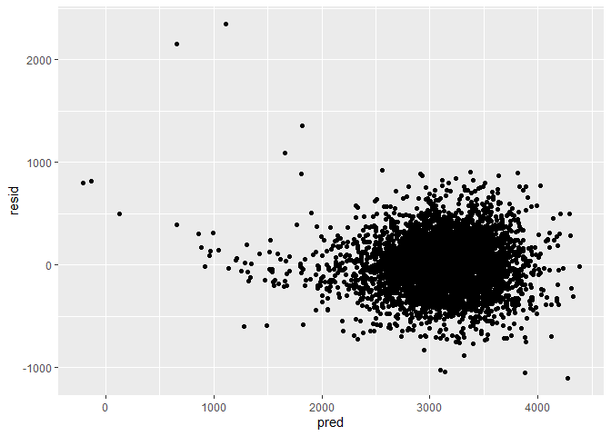

p8105\_hw6\_mss2284
================
Maya Spaur
11/16/2019

``` r
library(tidyverse)
```

    ## -- Attaching packages --------------------------------------------------- tidyverse 1.2.1 --

    ## v ggplot2 3.2.1     v purrr   0.3.3
    ## v tibble  2.1.3     v dplyr   0.8.3
    ## v tidyr   1.0.0     v stringr 1.4.0
    ## v readr   1.3.1     v forcats 0.4.0

    ## -- Conflicts ------------------------------------------------------ tidyverse_conflicts() --
    ## x dplyr::filter() masks stats::filter()
    ## x dplyr::lag()    masks stats::lag()

``` r
library(modelr)
library(mgcv)
```

    ## Loading required package: nlme

    ## 
    ## Attaching package: 'nlme'

    ## The following object is masked from 'package:dplyr':
    ## 
    ##     collapse

    ## This is mgcv 1.8-28. For overview type 'help("mgcv-package")'.

``` r
library(ggplot2)
```

\#Problem 1

Load and tidy data

\#have to convert into metric

``` r
data = 
  read_csv(file = "./data/birthweight.csv") %>%
  janitor::clean_names() %>%
  mutate(
    babysex = as.factor(babysex),
    frace = as.factor(frace),
    mrace = as.factor(mrace)
  )
```

    ## Parsed with column specification:
    ## cols(
    ##   .default = col_double()
    ## )

    ## See spec(...) for full column specifications.

In proposing a regression model for birthweight, I explore two different
model-building processes. The first uses a data-driven model-building
process, and the second uses a hypothesized structure and
cross-validation.

Modeling process: hypothesis testing

Model 1. This process is data-driven and is based on the variables that
are statistically significant.

``` r
model = lm(bwt ~ babysex + bhead + blength + delwt + fincome + frace + gaweeks + malform + menarche + mheight + momage + mrace + parity + pnumlbw + pnumsga + ppbmi + ppwt + smoken + wtgain, data = data)

model %>%
  broom::tidy() %>%
  knitr::kable(digits = 2)
```

| term        |  estimate | std.error | statistic | p.value |
| :---------- | --------: | --------: | --------: | ------: |
| (Intercept) | \-6265.39 |    660.40 |    \-9.49 |    0.00 |
| babysex2    |     28.71 |      8.47 |      3.39 |    0.00 |
| bhead       |    130.78 |      3.45 |     37.88 |    0.00 |
| blength     |     74.95 |      2.02 |     37.08 |    0.00 |
| delwt       |      4.10 |      0.39 |     10.39 |    0.00 |
| fincome     |      0.29 |      0.18 |      1.61 |    0.11 |
| frace2      |     14.33 |     46.15 |      0.31 |    0.76 |
| frace3      |     21.24 |     69.30 |      0.31 |    0.76 |
| frace4      |   \-47.00 |     44.68 |    \-1.05 |    0.29 |
| frace8      |      4.30 |     74.07 |      0.06 |    0.95 |
| gaweeks     |     11.55 |      1.47 |      7.88 |    0.00 |
| malform     |      9.76 |     70.63 |      0.14 |    0.89 |
| menarche    |    \-3.55 |      2.90 |    \-1.23 |    0.22 |
| mheight     |      9.79 |     10.31 |      0.95 |    0.34 |
| momage      |      0.76 |      1.22 |      0.62 |    0.53 |
| mrace2      |  \-151.44 |     46.05 |    \-3.29 |    0.00 |
| mrace3      |   \-91.39 |     71.92 |    \-1.27 |    0.20 |
| mrace4      |   \-56.48 |     45.14 |    \-1.25 |    0.21 |
| parity      |     95.54 |     40.48 |      2.36 |    0.02 |
| ppbmi       |      4.35 |     14.89 |      0.29 |    0.77 |
| ppwt        |    \-3.47 |      2.61 |    \-1.33 |    0.18 |
| smoken      |    \-4.85 |      0.59 |    \-8.27 |    0.00 |

Using this model-building process, the following variables were
statistically significant (p \< 0.05) and would be included in the
model:

babysex2, bhead, blength, delwt, gaweeks, mrace2, parity, and smoken.

Plot of model residuals against fitted values

``` r
modelr::add_residuals(data, model)
```

    ## Warning in predict.lm(model, data): prediction from a rank-deficient fit
    ## may be misleading

    ## # A tibble: 4,342 x 21
    ##    babysex bhead blength   bwt delwt fincome frace gaweeks malform menarche
    ##    <fct>   <dbl>   <dbl> <dbl> <dbl>   <dbl> <fct>   <dbl>   <dbl>    <dbl>
    ##  1 2          34      51  3629   177      35 1        39.9       0       13
    ##  2 1          34      48  3062   156      65 2        25.9       0       14
    ##  3 2          36      50  3345   148      85 1        39.9       0       12
    ##  4 1          34      52  3062   157      55 1        40         0       14
    ##  5 2          34      52  3374   156       5 1        41.6       0       13
    ##  6 1          33      52  3374   129      55 1        40.7       0       12
    ##  7 2          33      46  2523   126      96 2        40.3       0       14
    ##  8 2          33      49  2778   140       5 1        37.4       0       12
    ##  9 1          36      52  3515   146      85 1        40.3       0       11
    ## 10 1          33      50  3459   169      75 2        40.7       0       12
    ## # ... with 4,332 more rows, and 11 more variables: mheight <dbl>,
    ## #   momage <dbl>, mrace <fct>, parity <dbl>, pnumlbw <dbl>, pnumsga <dbl>,
    ## #   ppbmi <dbl>, ppwt <dbl>, smoken <dbl>, wtgain <dbl>, resid <dbl>

``` r
modelr::add_predictions(data, model)
```

    ## Warning in predict.lm(model, data): prediction from a rank-deficient fit
    ## may be misleading

    ## # A tibble: 4,342 x 21
    ##    babysex bhead blength   bwt delwt fincome frace gaweeks malform menarche
    ##    <fct>   <dbl>   <dbl> <dbl> <dbl>   <dbl> <fct>   <dbl>   <dbl>    <dbl>
    ##  1 2          34      51  3629   177      35 1        39.9       0       13
    ##  2 1          34      48  3062   156      65 2        25.9       0       14
    ##  3 2          36      50  3345   148      85 1        39.9       0       12
    ##  4 1          34      52  3062   157      55 1        40         0       14
    ##  5 2          34      52  3374   156       5 1        41.6       0       13
    ##  6 1          33      52  3374   129      55 1        40.7       0       12
    ##  7 2          33      46  2523   126      96 2        40.3       0       14
    ##  8 2          33      49  2778   140       5 1        37.4       0       12
    ##  9 1          36      52  3515   146      85 1        40.3       0       11
    ## 10 1          33      50  3459   169      75 2        40.7       0       12
    ## # ... with 4,332 more rows, and 11 more variables: mheight <dbl>,
    ## #   momage <dbl>, mrace <fct>, parity <dbl>, pnumlbw <dbl>, pnumsga <dbl>,
    ## #   ppbmi <dbl>, ppwt <dbl>, smoken <dbl>, wtgain <dbl>, pred <dbl>

``` r
plot =
  data %>% 
  modelr::add_residuals(model) %>% 
  modelr::add_predictions(model) %>%
  ggplot(aes(x = pred, y = resid)) + geom_violin()
```

    ## Warning in predict.lm(model, data): prediction from a rank-deficient fit
    ## may be misleading
    
    ## Warning in predict.lm(model, data): prediction from a rank-deficient fit
    ## may be misleading

``` r
plot
```

<!-- -->

``` r
scatter_plot =
  data %>% 
  modelr::add_residuals(model) %>% 
  modelr::add_predictions(model) %>%
  ggplot(aes(x = pred, y = resid)) + geom_point()
```

    ## Warning in predict.lm(model, data): prediction from a rank-deficient fit
    ## may be misleading
    
    ## Warning in predict.lm(model, data): prediction from a rank-deficient fit
    ## may be misleading

``` r
scatter_plot
```

<!-- -->

Model 2. Modeling process: cross-validation

Using cross-validation, another way of forming the model would be based
on what kind of variables I think are related to the outcome
(babyweight), and to retain variables in the model that I think are
plausible to include even if the model does not find them statistically
significant.

I propose to include mother and father’s race, family income, .. etc.

\#to look at the estimates, do that on the whole dataset and fit it once
(linear model) and then use the cross-validation of your model to see
how well it would predict other observations\!

``` r
cv_df =
  crossv_mc(data, 100)

cv_df %>% pull(train) %>% .[[1]] %>% as_tibble
```

    ## # A tibble: 3,473 x 20
    ##    babysex bhead blength   bwt delwt fincome frace gaweeks malform menarche
    ##    <fct>   <dbl>   <dbl> <dbl> <dbl>   <dbl> <fct>   <dbl>   <dbl>    <dbl>
    ##  1 2          34      51  3629   177      35 1        39.9       0       13
    ##  2 1          34      52  3062   157      55 1        40         0       14
    ##  3 2          33      46  2523   126      96 2        40.3       0       14
    ##  4 1          33      50  3459   169      75 2        40.7       0       12
    ##  5 1          35      51  3459   146      55 1        39.4       0       12
    ##  6 2          35      48  3175   158      75 1        39.7       0       13
    ##  7 1          36      53  3629   147      75 1        41.3       0       11
    ##  8 1          35      51  3544   129      65 1        39.6       0       12
    ##  9 2          33      49  2551   120      75 2        38.1       0       11
    ## 10 1          35      56  3232   147      55 1        42.1       0       13
    ## # ... with 3,463 more rows, and 10 more variables: mheight <dbl>,
    ## #   momage <dbl>, mrace <fct>, parity <dbl>, pnumlbw <dbl>, pnumsga <dbl>,
    ## #   ppbmi <dbl>, ppwt <dbl>, smoken <dbl>, wtgain <dbl>

``` r
cv_df %>% pull(test) %>% .[[1]] %>% as_tibble
```

    ## # A tibble: 869 x 20
    ##    babysex bhead blength   bwt delwt fincome frace gaweeks malform menarche
    ##    <fct>   <dbl>   <dbl> <dbl> <dbl>   <dbl> <fct>   <dbl>   <dbl>    <dbl>
    ##  1 1          34      48  3062   156      65 2        25.9       0       14
    ##  2 2          36      50  3345   148      85 1        39.9       0       12
    ##  3 2          34      52  3374   156       5 1        41.6       0       13
    ##  4 1          33      52  3374   129      55 1        40.7       0       12
    ##  5 2          33      49  2778   140       5 1        37.4       0       12
    ##  6 1          36      52  3515   146      85 1        40.3       0       11
    ##  7 2          35      51  3317   130      55 1        43.4       0       13
    ##  8 2          34      52  3629   112      25 1        38         0       10
    ##  9 2          34      51  3232   155      55 1        41.6       0       15
    ## 10 2          33      49  3147   140      45 1        40.6       0       12
    ## # ... with 859 more rows, and 10 more variables: mheight <dbl>,
    ## #   momage <dbl>, mrace <fct>, parity <dbl>, pnumlbw <dbl>, pnumsga <dbl>,
    ## #   ppbmi <dbl>, ppwt <dbl>, smoken <dbl>, wtgain <dbl>

``` r
cv_df =
  cv_df %>% 
  mutate(
    train = map(train, as_tibble),
    test = map(test, as_tibble))

cv_df = 
  cv_df %>% 
  mutate(linear_mod  = map(train, ~lm(bwt ~ frace + mrace + fincome + pnumlbw + smoken + gaweeks + malform + momage, data = .x))) %>% 
  mutate(rmse_linear = map2_dbl(linear_mod, test, ~rmse(model = .x, data = .y))) 
```

    ## Warning in predict.lm(model, data): prediction from a rank-deficient fit
    ## may be misleading
    
    ## Warning in predict.lm(model, data): prediction from a rank-deficient fit
    ## may be misleading
    
    ## Warning in predict.lm(model, data): prediction from a rank-deficient fit
    ## may be misleading
    
    ## Warning in predict.lm(model, data): prediction from a rank-deficient fit
    ## may be misleading
    
    ## Warning in predict.lm(model, data): prediction from a rank-deficient fit
    ## may be misleading
    
    ## Warning in predict.lm(model, data): prediction from a rank-deficient fit
    ## may be misleading
    
    ## Warning in predict.lm(model, data): prediction from a rank-deficient fit
    ## may be misleading
    
    ## Warning in predict.lm(model, data): prediction from a rank-deficient fit
    ## may be misleading
    
    ## Warning in predict.lm(model, data): prediction from a rank-deficient fit
    ## may be misleading
    
    ## Warning in predict.lm(model, data): prediction from a rank-deficient fit
    ## may be misleading
    
    ## Warning in predict.lm(model, data): prediction from a rank-deficient fit
    ## may be misleading
    
    ## Warning in predict.lm(model, data): prediction from a rank-deficient fit
    ## may be misleading
    
    ## Warning in predict.lm(model, data): prediction from a rank-deficient fit
    ## may be misleading
    
    ## Warning in predict.lm(model, data): prediction from a rank-deficient fit
    ## may be misleading
    
    ## Warning in predict.lm(model, data): prediction from a rank-deficient fit
    ## may be misleading
    
    ## Warning in predict.lm(model, data): prediction from a rank-deficient fit
    ## may be misleading
    
    ## Warning in predict.lm(model, data): prediction from a rank-deficient fit
    ## may be misleading
    
    ## Warning in predict.lm(model, data): prediction from a rank-deficient fit
    ## may be misleading
    
    ## Warning in predict.lm(model, data): prediction from a rank-deficient fit
    ## may be misleading
    
    ## Warning in predict.lm(model, data): prediction from a rank-deficient fit
    ## may be misleading
    
    ## Warning in predict.lm(model, data): prediction from a rank-deficient fit
    ## may be misleading
    
    ## Warning in predict.lm(model, data): prediction from a rank-deficient fit
    ## may be misleading
    
    ## Warning in predict.lm(model, data): prediction from a rank-deficient fit
    ## may be misleading
    
    ## Warning in predict.lm(model, data): prediction from a rank-deficient fit
    ## may be misleading
    
    ## Warning in predict.lm(model, data): prediction from a rank-deficient fit
    ## may be misleading
    
    ## Warning in predict.lm(model, data): prediction from a rank-deficient fit
    ## may be misleading
    
    ## Warning in predict.lm(model, data): prediction from a rank-deficient fit
    ## may be misleading
    
    ## Warning in predict.lm(model, data): prediction from a rank-deficient fit
    ## may be misleading
    
    ## Warning in predict.lm(model, data): prediction from a rank-deficient fit
    ## may be misleading
    
    ## Warning in predict.lm(model, data): prediction from a rank-deficient fit
    ## may be misleading
    
    ## Warning in predict.lm(model, data): prediction from a rank-deficient fit
    ## may be misleading
    
    ## Warning in predict.lm(model, data): prediction from a rank-deficient fit
    ## may be misleading
    
    ## Warning in predict.lm(model, data): prediction from a rank-deficient fit
    ## may be misleading
    
    ## Warning in predict.lm(model, data): prediction from a rank-deficient fit
    ## may be misleading
    
    ## Warning in predict.lm(model, data): prediction from a rank-deficient fit
    ## may be misleading
    
    ## Warning in predict.lm(model, data): prediction from a rank-deficient fit
    ## may be misleading
    
    ## Warning in predict.lm(model, data): prediction from a rank-deficient fit
    ## may be misleading
    
    ## Warning in predict.lm(model, data): prediction from a rank-deficient fit
    ## may be misleading
    
    ## Warning in predict.lm(model, data): prediction from a rank-deficient fit
    ## may be misleading
    
    ## Warning in predict.lm(model, data): prediction from a rank-deficient fit
    ## may be misleading
    
    ## Warning in predict.lm(model, data): prediction from a rank-deficient fit
    ## may be misleading
    
    ## Warning in predict.lm(model, data): prediction from a rank-deficient fit
    ## may be misleading
    
    ## Warning in predict.lm(model, data): prediction from a rank-deficient fit
    ## may be misleading
    
    ## Warning in predict.lm(model, data): prediction from a rank-deficient fit
    ## may be misleading
    
    ## Warning in predict.lm(model, data): prediction from a rank-deficient fit
    ## may be misleading
    
    ## Warning in predict.lm(model, data): prediction from a rank-deficient fit
    ## may be misleading
    
    ## Warning in predict.lm(model, data): prediction from a rank-deficient fit
    ## may be misleading
    
    ## Warning in predict.lm(model, data): prediction from a rank-deficient fit
    ## may be misleading
    
    ## Warning in predict.lm(model, data): prediction from a rank-deficient fit
    ## may be misleading
    
    ## Warning in predict.lm(model, data): prediction from a rank-deficient fit
    ## may be misleading
    
    ## Warning in predict.lm(model, data): prediction from a rank-deficient fit
    ## may be misleading
    
    ## Warning in predict.lm(model, data): prediction from a rank-deficient fit
    ## may be misleading
    
    ## Warning in predict.lm(model, data): prediction from a rank-deficient fit
    ## may be misleading
    
    ## Warning in predict.lm(model, data): prediction from a rank-deficient fit
    ## may be misleading
    
    ## Warning in predict.lm(model, data): prediction from a rank-deficient fit
    ## may be misleading
    
    ## Warning in predict.lm(model, data): prediction from a rank-deficient fit
    ## may be misleading
    
    ## Warning in predict.lm(model, data): prediction from a rank-deficient fit
    ## may be misleading
    
    ## Warning in predict.lm(model, data): prediction from a rank-deficient fit
    ## may be misleading
    
    ## Warning in predict.lm(model, data): prediction from a rank-deficient fit
    ## may be misleading
    
    ## Warning in predict.lm(model, data): prediction from a rank-deficient fit
    ## may be misleading
    
    ## Warning in predict.lm(model, data): prediction from a rank-deficient fit
    ## may be misleading
    
    ## Warning in predict.lm(model, data): prediction from a rank-deficient fit
    ## may be misleading
    
    ## Warning in predict.lm(model, data): prediction from a rank-deficient fit
    ## may be misleading
    
    ## Warning in predict.lm(model, data): prediction from a rank-deficient fit
    ## may be misleading
    
    ## Warning in predict.lm(model, data): prediction from a rank-deficient fit
    ## may be misleading
    
    ## Warning in predict.lm(model, data): prediction from a rank-deficient fit
    ## may be misleading
    
    ## Warning in predict.lm(model, data): prediction from a rank-deficient fit
    ## may be misleading
    
    ## Warning in predict.lm(model, data): prediction from a rank-deficient fit
    ## may be misleading
    
    ## Warning in predict.lm(model, data): prediction from a rank-deficient fit
    ## may be misleading
    
    ## Warning in predict.lm(model, data): prediction from a rank-deficient fit
    ## may be misleading
    
    ## Warning in predict.lm(model, data): prediction from a rank-deficient fit
    ## may be misleading
    
    ## Warning in predict.lm(model, data): prediction from a rank-deficient fit
    ## may be misleading
    
    ## Warning in predict.lm(model, data): prediction from a rank-deficient fit
    ## may be misleading
    
    ## Warning in predict.lm(model, data): prediction from a rank-deficient fit
    ## may be misleading
    
    ## Warning in predict.lm(model, data): prediction from a rank-deficient fit
    ## may be misleading
    
    ## Warning in predict.lm(model, data): prediction from a rank-deficient fit
    ## may be misleading
    
    ## Warning in predict.lm(model, data): prediction from a rank-deficient fit
    ## may be misleading
    
    ## Warning in predict.lm(model, data): prediction from a rank-deficient fit
    ## may be misleading
    
    ## Warning in predict.lm(model, data): prediction from a rank-deficient fit
    ## may be misleading
    
    ## Warning in predict.lm(model, data): prediction from a rank-deficient fit
    ## may be misleading
    
    ## Warning in predict.lm(model, data): prediction from a rank-deficient fit
    ## may be misleading
    
    ## Warning in predict.lm(model, data): prediction from a rank-deficient fit
    ## may be misleading
    
    ## Warning in predict.lm(model, data): prediction from a rank-deficient fit
    ## may be misleading
    
    ## Warning in predict.lm(model, data): prediction from a rank-deficient fit
    ## may be misleading
    
    ## Warning in predict.lm(model, data): prediction from a rank-deficient fit
    ## may be misleading
    
    ## Warning in predict.lm(model, data): prediction from a rank-deficient fit
    ## may be misleading
    
    ## Warning in predict.lm(model, data): prediction from a rank-deficient fit
    ## may be misleading
    
    ## Warning in predict.lm(model, data): prediction from a rank-deficient fit
    ## may be misleading
    
    ## Warning in predict.lm(model, data): prediction from a rank-deficient fit
    ## may be misleading
    
    ## Warning in predict.lm(model, data): prediction from a rank-deficient fit
    ## may be misleading
    
    ## Warning in predict.lm(model, data): prediction from a rank-deficient fit
    ## may be misleading
    
    ## Warning in predict.lm(model, data): prediction from a rank-deficient fit
    ## may be misleading
    
    ## Warning in predict.lm(model, data): prediction from a rank-deficient fit
    ## may be misleading
    
    ## Warning in predict.lm(model, data): prediction from a rank-deficient fit
    ## may be misleading
    
    ## Warning in predict.lm(model, data): prediction from a rank-deficient fit
    ## may be misleading
    
    ## Warning in predict.lm(model, data): prediction from a rank-deficient fit
    ## may be misleading
    
    ## Warning in predict.lm(model, data): prediction from a rank-deficient fit
    ## may be misleading
    
    ## Warning in predict.lm(model, data): prediction from a rank-deficient fit
    ## may be misleading
    
    ## Warning in predict.lm(model, data): prediction from a rank-deficient fit
    ## may be misleading
    
    ## Warning in predict.lm(model, data): prediction from a rank-deficient fit
    ## may be misleading

``` r
plot2 = 
  cv_df %>% 
  select(starts_with("rmse")) %>% 
  pivot_longer(
    everything(),
    names_to = "model", 
    values_to = "rmse",
    names_prefix = "rmse_") %>% 
  mutate(model = fct_inorder(model)) %>% 
  ggplot(aes(x = model, y = rmse)) + geom_violin()

plot2
```

<!-- -->

\#Make one plot per model

Main Effects Model

``` r
main_effects = lm(bwt ~ blength + gaweeks, data = data)

main_effects %>%
  broom::tidy()
```

    ## # A tibble: 3 x 5
    ##   term        estimate std.error statistic  p.value
    ##   <chr>          <dbl>     <dbl>     <dbl>    <dbl>
    ## 1 (Intercept)  -4348.      98.0      -44.4 0.      
    ## 2 blength        129.       1.99      64.6 0.      
    ## 3 gaweeks         27.0      1.72      15.7 2.36e-54

\#r generates interaction terms for everything when doing these types of
models, so JUST look at the p value for the interaction term to assess
if it’s statistically significant\!

``` r
interaction_effects = lm(bwt ~ blength + gaweeks + (bhead*blength*babysex), data = data)

interaction_effects %>%
  broom::tidy()
```

    ## # A tibble: 9 x 5
    ##   term                    estimate std.error statistic  p.value
    ##   <chr>                      <dbl>     <dbl>     <dbl>    <dbl>
    ## 1 (Intercept)            -5840.     1259.       -4.64  3.63e- 6
    ## 2 blength                   68.2      26.2       2.61  9.22e- 3
    ## 3 gaweeks                   14.7       1.52      9.65  7.86e-22
    ## 4 bhead                    129.       38.1       3.39  7.03e- 4
    ## 5 babysex2                5619.     1662.        3.38  7.29e- 4
    ## 6 blength:bhead              0.372     0.778     0.478 6.33e- 1
    ## 7 bhead:babysex2          -175.       50.6      -3.47  5.34e- 4
    ## 8 blength:babysex2        -109.       34.8      -3.14  1.71e- 3
    ## 9 blength:bhead:babysex2     3.43      1.05      3.28  1.06e- 3

One using head circumference, length, sex, and all interactions
(including the three-way interaction) between these… \#just look at the
3-way interaction term\!

\#Problem 2

    ## Registered S3 method overwritten by 'crul':
    ##   method                 from
    ##   as.character.form_file httr

    ## Registered S3 method overwritten by 'hoardr':
    ##   method           from
    ##   print.cache_info httr

    ## file path:          C:\Users\Maya\AppData\Local\rnoaa\rnoaa\Cache/ghcnd/USW00094728.dly

    ## file last updated:  2019-09-26 10:28:36

    ## file min/max dates: 1869-01-01 / 2019-09-30

Bootstraps
