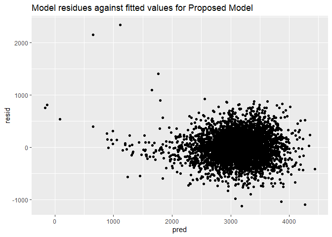

p8105\_hw6\_mss2284
================
Maya Spaur
11/16/2019

``` r
library(tidyverse)
```

    ## -- Attaching packages --------------------------------------- tidyverse 1.2.1 --

    ## v ggplot2 3.2.1     v purrr   0.3.3
    ## v tibble  2.1.3     v dplyr   0.8.3
    ## v tidyr   1.0.0     v stringr 1.4.0
    ## v readr   1.3.1     v forcats 0.4.0

    ## -- Conflicts ------------------------------------------ tidyverse_conflicts() --
    ## x dplyr::filter() masks stats::filter()
    ## x dplyr::lag()    masks stats::lag()

``` r
library(modelr)
library(mgcv)
```

    ## Loading required package: nlme

    ## 
    ## Attaching package: 'nlme'

    ## The following object is masked from 'package:dplyr':
    ## 
    ##     collapse

    ## This is mgcv 1.8-28. For overview type 'help("mgcv-package")'.

``` r
library(ggplot2)
```

\#Problem 1

Load and tidy data: categorical variabels were converted into factor
variables, and variables that had units in pounds (delwt, ppwt, wtgain)
were converted to grams.

``` r
data = 
  read_csv(file = "./data/birthweight.csv") %>%
  janitor::clean_names() %>%
  mutate(
    babysex = as.factor(babysex),
    frace = as.factor(frace),
    mrace = as.factor(mrace),
    delwt = 453.592*delwt,
    ppwt = 453.592*ppwt,
    wtgain = 453.592*wtgain
  )
```

    ## Parsed with column specification:
    ## cols(
    ##   .default = col_double()
    ## )

    ## See spec(...) for full column specifications.

In proposing a regression model for birthweight, I explore two different
model-building processes. The first uses a data-driven model-building
process, and the second uses a hypothesized structure and
cross-validation.

Modeling process: hypothesis testing

Model 1. This process is data-driven and is based on the variables that
are statistically significant.

``` r
model = lm(bwt ~ babysex + bhead + blength + delwt + fincome + frace + gaweeks + malform + menarche + mheight + momage + mrace + parity + pnumlbw + pnumsga + ppbmi + ppwt + smoken + wtgain, data = data)

model %>%
  broom::tidy() %>%
  knitr::kable(digits = 2)
```

| term        |  estimate | std.error | statistic | p.value |
| :---------- | --------: | --------: | --------: | ------: |
| (Intercept) | \-6265.39 |    660.40 |    \-9.49 |    0.00 |
| babysex2    |     28.71 |      8.47 |      3.39 |    0.00 |
| bhead       |    130.78 |      3.45 |     37.88 |    0.00 |
| blength     |     74.95 |      2.02 |     37.08 |    0.00 |
| delwt       |      0.01 |      0.00 |     10.39 |    0.00 |
| fincome     |      0.29 |      0.18 |      1.61 |    0.11 |
| frace2      |     14.33 |     46.15 |      0.31 |    0.76 |
| frace3      |     21.24 |     69.30 |      0.31 |    0.76 |
| frace4      |   \-47.00 |     44.68 |    \-1.05 |    0.29 |
| frace8      |      4.30 |     74.07 |      0.06 |    0.95 |
| gaweeks     |     11.55 |      1.47 |      7.88 |    0.00 |
| malform     |      9.76 |     70.63 |      0.14 |    0.89 |
| menarche    |    \-3.55 |      2.90 |    \-1.23 |    0.22 |
| mheight     |      9.79 |     10.31 |      0.95 |    0.34 |
| momage      |      0.76 |      1.22 |      0.62 |    0.53 |
| mrace2      |  \-151.44 |     46.05 |    \-3.29 |    0.00 |
| mrace3      |   \-91.39 |     71.92 |    \-1.27 |    0.20 |
| mrace4      |   \-56.48 |     45.14 |    \-1.25 |    0.21 |
| parity      |     95.54 |     40.48 |      2.36 |    0.02 |
| ppbmi       |      4.35 |     14.89 |      0.29 |    0.77 |
| ppwt        |    \-0.01 |      0.01 |    \-1.33 |    0.18 |
| smoken      |    \-4.85 |      0.59 |    \-8.27 |    0.00 |

Using this model-building process, the following variables were
statistically significant (p \< 0.05) and would be included in the
proposed model:

babysex2, bhead, blength, delwt, gaweeks, mrace2, parity, and smoken.

Plot of model residuals against fitted values:

``` r
proposed_model = lm(bwt ~ babysex+ bhead + blength + delwt + gaweeks+ mrace + parity + smoken, data = data)

scatter_plot =
  data %>% 
  modelr::add_residuals(proposed_model) %>% 
  modelr::add_predictions(proposed_model) %>%
  ggplot(aes(x = pred, y = resid)) + geom_point()

scatter_plot
```

<!-- -->

To assess the predictive ability of this model, a cross-validation
modeling process was also used, using a model based on the terms that
were found statistically significant in the proposed model: babysex2,
bhead, blength, delwt, gaweeks, mrace2, parity, and smoken

I propose to include these statistically significant variables in the
model.

``` r
cv_df =
  crossv_mc(data, 100)

cv_df %>% pull(train) %>% .[[1]] %>% as_tibble
```

    ## # A tibble: 3,473 x 20
    ##    babysex bhead blength   bwt  delwt fincome frace gaweeks malform
    ##    <fct>   <dbl>   <dbl> <dbl>  <dbl>   <dbl> <fct>   <dbl>   <dbl>
    ##  1 2          34      51  3629 80286.      35 1        39.9       0
    ##  2 1          34      48  3062 70760.      65 2        25.9       0
    ##  3 2          36      50  3345 67132.      85 1        39.9       0
    ##  4 1          34      52  3062 71214.      55 1        40         0
    ##  5 2          34      52  3374 70760.       5 1        41.6       0
    ##  6 1          33      52  3374 58513.      55 1        40.7       0
    ##  7 2          33      46  2523 57153.      96 2        40.3       0
    ##  8 2          33      49  2778 63503.       5 1        37.4       0
    ##  9 1          36      52  3515 66224.      85 1        40.3       0
    ## 10 1          33      50  3459 76657.      75 2        40.7       0
    ## # ... with 3,463 more rows, and 11 more variables: menarche <dbl>,
    ## #   mheight <dbl>, momage <dbl>, mrace <fct>, parity <dbl>, pnumlbw <dbl>,
    ## #   pnumsga <dbl>, ppbmi <dbl>, ppwt <dbl>, smoken <dbl>, wtgain <dbl>

``` r
cv_df %>% pull(test) %>% .[[1]] %>% as_tibble
```

    ## # A tibble: 869 x 20
    ##    babysex bhead blength   bwt  delwt fincome frace gaweeks malform
    ##    <fct>   <dbl>   <dbl> <dbl>  <dbl>   <dbl> <fct>   <dbl>   <dbl>
    ##  1 2          33      49  2551 54431.      75 2        38.1       0
    ##  2 1          35      56  3232 66678.      55 1        42.1       0
    ##  3 1          34      52  3203 60781.      25 1        41.1       0
    ##  4 1          34      63  3175 64864.      25 1        41.9       0
    ##  5 1          35      51  3345 65771.      75 1        41.3       0
    ##  6 2          34      49  3118 73028.      45 2        38.9       0
    ##  7 1          36      54  3402 73028.      95 1        40.1       0
    ##  8 1          35      55  3856 77564.      85 1        41.1       0
    ##  9 2          35      53  3600 63956.      35 1        42.3       0
    ## 10 2          34      49  2948 61235.      75 1        42.7       0
    ## # ... with 859 more rows, and 11 more variables: menarche <dbl>,
    ## #   mheight <dbl>, momage <dbl>, mrace <fct>, parity <dbl>, pnumlbw <dbl>,
    ## #   pnumsga <dbl>, ppbmi <dbl>, ppwt <dbl>, smoken <dbl>, wtgain <dbl>

``` r
cv_df =
  cv_df %>% 
  mutate(
    train = map(train, as_tibble),
    test = map(test, as_tibble))

cv_df = 
  cv_df %>% 
  mutate(linear_mod  = map(train, ~lm(bwt ~ babysex+bhead+blength+ delwt+ gaweeks+ mrace + parity + smoken, data = .x))) %>% 
  mutate(rmse_linear = map2_dbl(linear_mod, test, ~rmse(model = .x, data = .y))) 
```

    ## Warning in predict.lm(model, data): prediction from a rank-deficient fit
    ## may be misleading
    
    ## Warning in predict.lm(model, data): prediction from a rank-deficient fit
    ## may be misleading

Plot of the distribution of RMSE values

``` r
plot2 = 
  cv_df %>% 
  select(starts_with("rmse")) %>% 
  pivot_longer(
    everything(),
    names_to = "model", 
    values_to = "rmse",
    names_prefix = "rmse_") %>% 
  mutate(model = fct_inorder(model)) %>% 
  ggplot(aes(x = model, y = rmse)) + geom_violin()

plot2
```

<!-- -->

Given the distribution of RMSE values, this corresponds to the RMSE for
the proposed linear model above, with 271.7822246. However, these values
are still high so the model is not expected to be highly predictive of
other observations.

\#Make one plot per model

Main Effects Model

``` r
main_effects = lm(bwt ~ blength + gaweeks, data = data)

main_effects %>%
  broom::tidy()
```

    ## # A tibble: 3 x 5
    ##   term        estimate std.error statistic  p.value
    ##   <chr>          <dbl>     <dbl>     <dbl>    <dbl>
    ## 1 (Intercept)  -4348.      98.0      -44.4 0.      
    ## 2 blength        129.       1.99      64.6 0.      
    ## 3 gaweeks         27.0      1.72      15.7 2.36e-54

``` r
plot_main_effects =
  data %>% 
  modelr::add_residuals(main_effects) %>%
  modelr::add_predictions(main_effects) %>%
  ggplot(aes(x = pred, y = resid)) + geom_point()

plot_main_effects
```

<!-- -->

\#r generates interaction terms for everything when doing these types of
models, so JUST look at the p value for the interaction term to assess
if it’s statistically significant\!

``` r
interaction_effects = lm(bwt ~ blength + gaweeks + (bhead*blength*babysex), data = data)

interaction_effects %>%
  broom::tidy()
```

    ## # A tibble: 9 x 5
    ##   term                    estimate std.error statistic  p.value
    ##   <chr>                      <dbl>     <dbl>     <dbl>    <dbl>
    ## 1 (Intercept)            -5840.     1259.       -4.64  3.63e- 6
    ## 2 blength                   68.2      26.2       2.61  9.22e- 3
    ## 3 gaweeks                   14.7       1.52      9.65  7.86e-22
    ## 4 bhead                    129.       38.1       3.39  7.03e- 4
    ## 5 babysex2                5619.     1662.        3.38  7.29e- 4
    ## 6 blength:bhead              0.372     0.778     0.478 6.33e- 1
    ## 7 bhead:babysex2          -175.       50.6      -3.47  5.34e- 4
    ## 8 blength:babysex2        -109.       34.8      -3.14  1.71e- 3
    ## 9 blength:bhead:babysex2     3.43      1.05      3.28  1.06e- 3

``` r
plot_interaction_effects =
  data %>% 
  modelr::add_residuals(interaction_effects) %>%
  modelr::add_predictions(interaction_effects) %>%
  ggplot(aes(x = pred, y = resid)) + geom_point()

plot_interaction_effects
```

<!-- -->

For the model containing babysex, bhead, blength, and the interactions
between these variables, the interaction terms were statistically
significant.

Compare models

\#Error in seq\_len(n) : argument must be coercible to non-negative
integer

r comparing models cv\_bwt\_df = crossv\_mc(data, 100) %\>% mutate(
train = map(train, as\_tibble), test = map(test, as\_tibble))

cv\_bwt\_df = cv\_bwt\_df %\>% mutate(proposed\_model = map(train,
\~lm(bwt \~ babysex+ bhead + blength + delwt + gaweeks+ mrace + parity +
smoken, data = .x)), main\_effects = map(train, \~lm(bwt \~ blength +
gaweeks, data = .x)), interaction\_effects = map(train, \~lm(bwt \~
blength + gaweeks + (bhead*blength*babysex), data = .x))) %\>%
mutate(rmse\_proposed = map2\_dbl(proposed\_model, test, \~rmse(model =
.x, data = .y)), rmse\_main\_effects = map2\_dbl(main\_effects, test,
\~rmse(model = .x, data = .y)), rmse\_interaction\_effects =
map2\_dbl(interaction\_effects, test, \~rmse(model = .x, data = .y)))

\#Error? How to adjust broom::tidy –\> gives estimates for beta0 and
beta1, can compute the log(beta0 and beta1 by creating a new column).
have to pivot the estimate wider \#get CI by taking the percentiles

\#Problem 2

r, echo = FALSE weather\_df = rnoaa::meteo\_pull\_monitors(
c(“USW00094728”), var = c(“PRCP”, “TMIN”, “TMAX”), date\_min =
“2017-01-01”, date\_max = “2017-12-31”) %\>% mutate( name = recode(id,
USW00094728 = “CentralPark\_NY”), tmin = tmin / 10, tmax = tmax / 10)
%\>% select(name, id, everything()) \`\`\`

Bootstraps

r set.seed(1)

boot\_straps = weather\_df %\>% modelr::bootstrap(n = 5000) %\>%
mutate(models = map(strap, \~lm(tmax \~ tmin, data = .x)), results =
map(models, broom::glance()), reults\_2 = map(models, broom::tidy()))
%\>% select(-strap, -models) %\>% unnest(results) %\>% group\_by(term)
%\>% summarize(r\_squared = coef(estimate))
